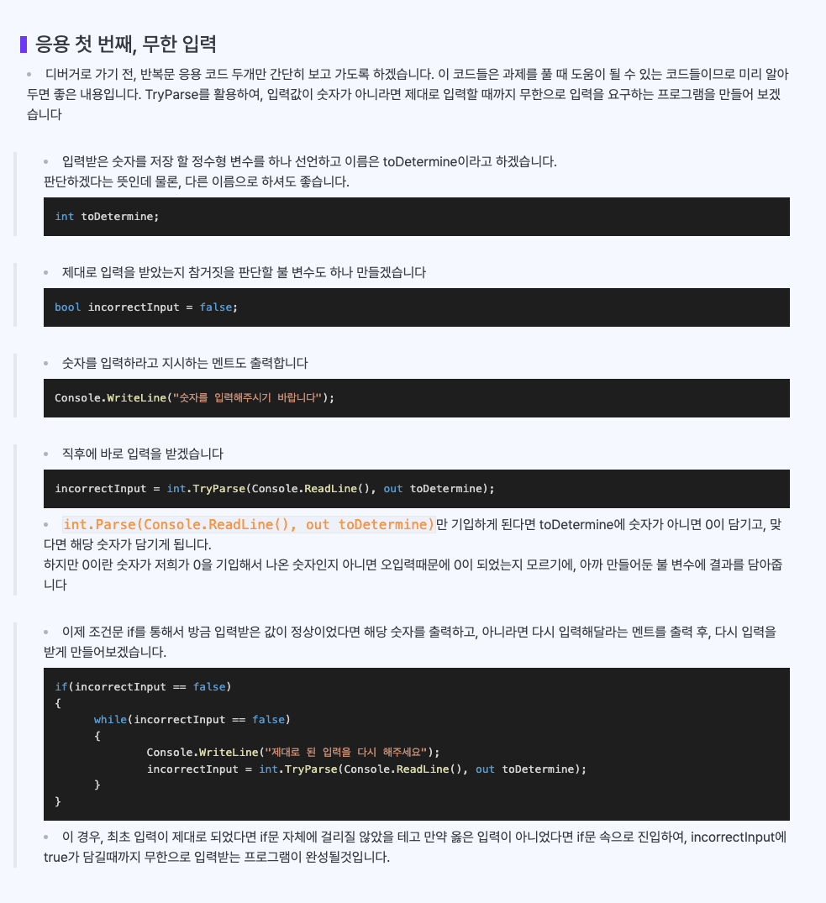
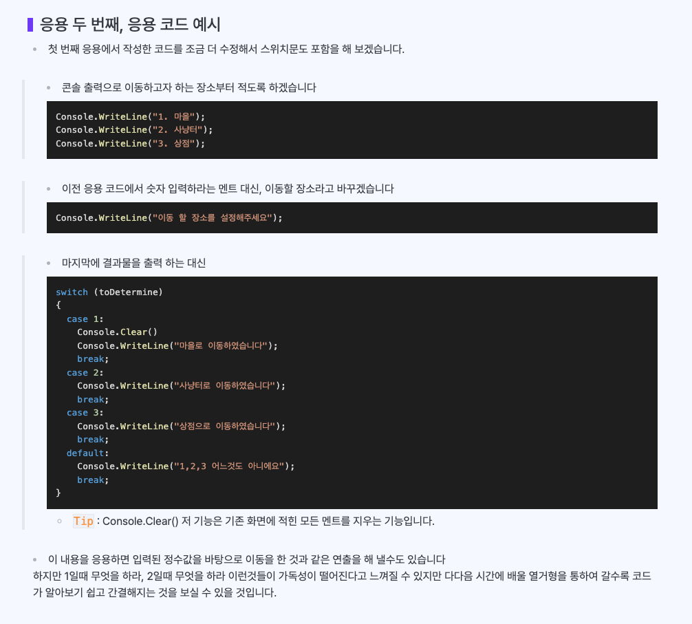

# 5교시 - 2024.03.13
## for 문
- 초기화, 조건식, 증감연산으로 구성된 반복문
- 괄호안에 일회성 변수 사용하여 일회성으로 사용할 수 있다 이걸 초기식이라고한다.
- 괄호안에 초기화 후 밖에서 변수를 호출하면 사용하지 못한다.
- 그래서 초기식으로 사용하지 않고 상황에 따라 밖에 변수 선언 후 초기화 하는 방식으로도 사용하면 된다
- 횟수 반복때 장점이 있다(명확히 범위가 정해져 있을 떄)
```angular2html
        // 프로그램에서는 0을 쓰는게 국룰
        //    초기화식 ;  조건식 ; 증감연산
        for (int i = 0 ; i < 10 ; i++) // 10번 반복 하자
        {
           // 반복할 내용
           Console.WriteLine("똑같은 작업"); 
        }

        //    초기화식 ;  조건식 ; 차감연산
        for (int i = 5; i > 0; i--)
        {
           Console.WriteLine("카운트 다운 {0}", i); 
        }
```

## 전위 연산
- 앞에 ++나 --를 붙이는것
- 먼저 증감이나 차감을 한 후 출력 실행

## 후위 연산
- 뒤에 ++나 --를 붙이는것
- 출력 후 증감이나 차감을 한다


## 반복문 속의 조건문
```angular2html
        Console.WriteLine("삼육구 삼육구 삼육구");
        for (int i = 0 ; i < 10 ; i++) // 10번 반복 하자
        {
            if (i == 3 || i == 6 || i == 9)
            {
               Console.WriteLine("짝"); 
            }
            else
            {
               Console.WriteLine(i); 
            }
        }
```
```
        Console.WriteLine("홀짝게임");
        for (int i = 0 ; i < 10 ; i++) // 10번 반복 하자
        {
            if (i % 2 == 0)
            {
               Console.WriteLine("짝"); 
            }
            else
            {
               Console.WriteLine("홀"); 
            }
        }
```

## 반복문 속의 반복문
```angular2html
        // 3번 반복을 3번 반복한다 // 총 9번 작업이 된다.
        for (int i = 0; i < 3; i++)
        {
            for (int j = 0; j < 3; j++)
            {
                Console.WriteLine("반복한다!");
            }
        }
```
```angular2html
    for (int group = 1; group <= 9; group++)
    {
        for (int student = 1; student <= 10; student++)
        {
            Console.WriteLine("{0}반 {1}번째 학생", group, student);
        }
    }

```        
        
```angular2html
Console.WriteLine("구구단");
for (int dan = 2; dan <= 9; dan++)
{
    Console.WriteLine("   {0}단!", dan);
    for (int number = 1; number <= 9; number++)
    {
        Console.WriteLine("{0} * {1} = {2}", dan, number, dan * number);
    }
    Console.WriteLine();
}
```

## while문
- 조건식의 true, false에 따라 블록을 반복하는 반복문
- 어디에서 어디까지, 같은 범위가 확실히 정해져 있지 않는 경우 많이 쓰임
- 즉 조건이 만족할때 까지 계속 반복 가능하다는것
- 주의 사항 즘감 연산자가 안될 경우 무한반복의 위험성이 있다

```angular2html
// 동전 교환기
int coin = 400;
while (coin > 0)
{
    Console.WriteLine("100원 동전을 꺼냅니다.");
    coin -= 100;
}
```

```angular2html
// 시간 남아있으면 계속 다떨어지면 졸요
int time = 90;
while (time > 0)
{
    
}
```

## do while 반복
- while은 위에서 체크하서 false면 아예 실행을 안하는데
- do while은 무조건 한번 실행을 하고 조건을 확인 한다.
```angular2html
int choice;
do
{
    Console.Write("1에서 9사이의 수를 입력하세요 : ");
    string input = Console.ReadLine();
    int.TryParse(input, out choice);
} while ((choice >= 1 && choice <= 9) == false);
```

## Break문과 Continue문
### Break
- 가장 가까운 반복문을 종료
- 반복문을 그냥 끝내 버러는 역활

---

-  브레이크가 없을때 계속 반복하는데 브레이크 문이 있으면 가다가 그 단계에서 끝내 버린다
-  예) 인벤토리로 치면 0, 1,2,3,4 가  있으면 포션을 찾기 위해 반복을 하면서 계속 찾는다
- / 근대 포션을 3번째 칸에서 찾으면 brake 문으로 찾자마자 바로 끝내 버릴수있다 많약 break문이 없다면 끝까지 다 찾아보게 된다
 
```angular2html
while (true)
{
    Console.WriteLine("1");
    Console.WriteLine("2");
    Console.WriteLine("3");
    Console.WriteLine("4");

    break;

    Console.WriteLine("5");
    Console.WriteLine("6");
    Console.WriteLine("7");
    Console.WriteLine("8");
}

Console.WriteLine("게임종료");
```

```angular2html
int pointPos = 3;
for (int i = 1; i < 1000; i++)
{
    
    Console.WriteLine("{0}번째칸에 포션이 있는지 확인합니다", i);
    if (i == pointPos)
    {
        Console.WriteLine("포션을 찾았습니다");
        Console.WriteLine("포션을 합니다");
        break;
    }
}
```
while (true)
{
Console.WriteLine("1. 공격한다., 2. 방어한다. 3. 도망친다.");
Console.Write("행동을 선택하세요 : ");
int input = int.Parse(Console.ReadLine());

```angular2html


            if (input == 1)
            {
                Console.WriteLine("플레이어가 공격합니다.");   
            }
            else if (input == 2)
            {
                Console.WriteLine("플레이어가 방어합니다.");   
            }
            else if (input == 3)
            {
                Console.WriteLine("플레이어가 도망칩니다.");   
                break;
            }
            else 
            {
                Console.WriteLine("잘못 입력했습니다.");   
            }
            Console.WriteLine();
        }
```

```angular2html
        int num = 35;
        for (int i = 2; i < num; i++)
        {
            if (num % i == 0)
            {
                Console.WriteLine($"{num}을 나눌 수 있는 가장 작은 수는 {i} 입니다.");
                break;
            }
        }
```

### Continue
- 가장 가까운 반복문의 새 반복을 시작
- continue문이 있으면  제일 상단으로 간다
- 밑에있는 내용을 생략하고 위로 올라간다
```angular2html
while (true)
{
    Console.WriteLine("1");
    Console.WriteLine("2");
    Console.WriteLine("3");
    Console.WriteLine("4");

    continue;

    Console.WriteLine("5");
    Console.WriteLine("6");
    Console.WriteLine("7");
    Console.WriteLine("8");
}
```


```angular2html
        // 4번 플레이어가 무적이야, 내 캐릭터일 때 (귓속말)
        for (int i = 1; i <= 8; i++)
        {
            if (i == 4) // 나중에 무적 여부가 있음 더욱 좋음
            {
                Console.WriteLine("4번 플레이어는 무적이라 공격하지 못합니다.");
                continue;
            }
            
            if (i == 6) // 나중에 무적 여부가 있음 더욱 좋음
            {
                Console.WriteLine("6번 플레이어는 내 캐릭터라서 공격하지 못합니다.");
                continue;
            }
            Console.WriteLine("{0}번 플레이어를 공격합니다.", i);
        }
```
## 참고





