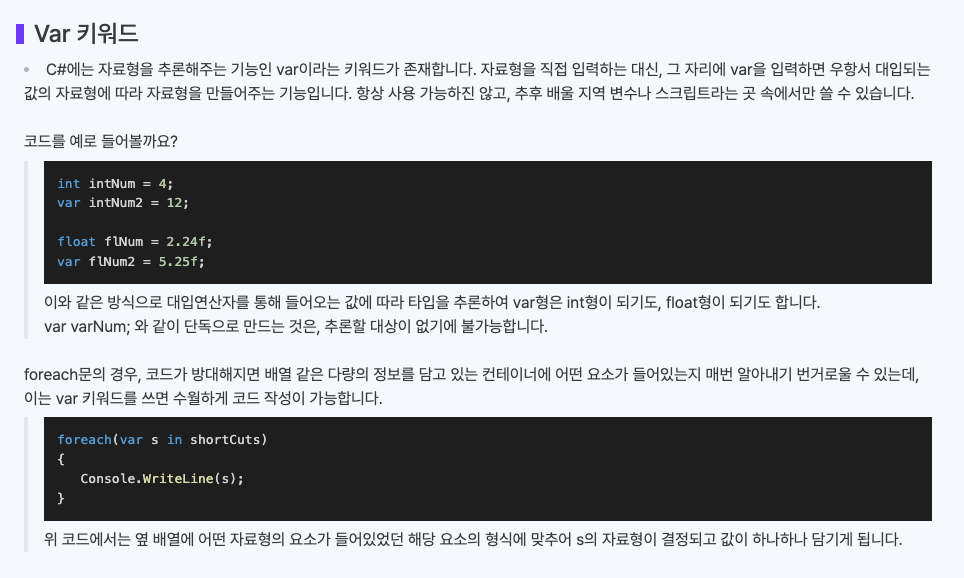

# 8교시 - 2024.03.17
## 배열 
- 배열의 선언 - string[] shoCuts;
- 4의 요소(인덱스)를 담을 것을 만들어 달라 - shoCuts = new string[4];
- 동일한 자료형의 요소들로 구성된 데이터 집합
- 인덱스를 통하여 배열에 접근할 수 있음
- 배열의 처음 요소릐 인덱스는 0부터 시작
- 배열은 값을 대입 안해도 자료형에 따라 기본값으로 세팅 되어 들어감
- 배열은 Length를 쓰고 List는 Count, Capacity라는 표형을 쓴다 ( 자료 구조 때 배움 )
- 배열은 최대 3차원까지만 사용하고 그 이상하용하는건 지양해야한다(복잡해짐)
### 타엽 종류
- 값타입
- 참조타입

#### 예제
- 뽑기
  -  갭슐 같은역활
```angular2html
-- 값 타입
int i4;
string s1;
-- 참조타입
int[] i1 = new int[2];
string[] i1 = new string[20];
```
```angular2html
하나의 변수에 하드코딩으로 값을 넣어주는것과 같다
예 ) string name = "xxx";
이런식으로 변수를 선언하고 작성하는것을 어렵다 
이럴경우 배열을 사용하여 쉽개 사용 가능하다
string [] -> 배열함수 
```

```angular2html
string i; 버장소 하나 만들기 -> 하나짜리
int[] val; 정수 여러개를 담을수 있는 저장소 만들기
- 배열에서는 한자기 더 작업이 필요하다
var = new int[10] -> 10개짜리 저장소 생성
예) 배열은 상품을 몇개 담을 봉투인지 정하는 것(식빵)
```


## 배열기본
- 배열을 만들기 위해 자료형과 크기를 정하여 새엇ㅇ
- 요소에 접근하기위해 [인덱스]를 사용
- Length를 통해 크지를 확인
- 자료형[] i1 = new 자료형[5] = 원하는 자료형 5개를 담을 수 있는 그릇(배열)
```angular2html
int[] sco = new int[5]; // 크기 5의 배열 선언
sco[0] = 10;
sco[1] = 10;
sco[2] = 10;
// 값을 대입한다


// 배열의 자릿수와 값이다
// | 0 | 1 | 2 | 3 | 4 | 5 |
// |10 | 10 | .......
// 왜 0부터 시작하냐면 "자"도 0 부터 시작해서 2번재 1칸 3번째 2칸 으로 들어간다 배열도 이런식으로 0부터 칸수로 사용한다
// 이걸 index 라고 부른다

// 배열 접근 방법
sco[0] = 10; // 0번째 요소 저장
Console.WriteLine(sco[1]); // 0번째 요소 불러오기
```

### 배열 선언
```
        int[] sco = new int[5]; // 크기 5의 배열 선언
        // int[] src : 배열로 만들꺼야 
        // new int[5] : 5개의 요소를 만드는것
        
        //  배열이 몇게인지 알고 싶을때  sco.Length로 요소의 총길이를 알 수 있다
        Console.WriteLine(sco.Length); // 0번째 요소 불러오기
        탑: 디버깅시 배열의 갯수가 많을 경우 조사식 디버깅으로 추가해서 디버깅 가능
```

## 배열 사용 방법
```angular2html
        string str1 = "포션";
        string str2 = "부적";
        int cho = int.Parse(Console.ReadLine());
        
        switch (cho) {
            case 1:
                Console.WriteLine(str1);
                break;
            case 2:
                Console.WriteLine(str2);
                break;
        }
        // 변수를 선언해서 사용하면 위처험 해야하지만 배열로 선언 후 작업 시
        string[] str = new string[4];
        str[0]="포션";
        str[1]="부적";
        str[2]="폭탄";

        if (str != null)
        {
            Console.WriteLine("{} 사용", str[cho]);
        }
        else if (cho < str.Length)
        {
            Console.WriteLine("범위를 벗어났습니다");
        }
        else
        {
            Console.WriteLine("없는 아이템");
        }
        //이렇게 단순화 시킬수 있다

```


## 배열과 반복
```
    string[] shortCuts = new string[4];

    shortCuts[0] = "포션";
    shortCuts[1] = "파폭";
    shortCuts[2] = "부적";
    shortCuts[3] = "폭탄";


[방법1]
    // 4개인데 2개를 쓴다면 2개만 나오거 4개인데 5를 쓰면 터진다
    for (int i = 0; i < 4; i++) // 인덱스라서 줄여서i로 사용되어온게 국룰
    {
        Console.WriteLine("{0}번째 아이템은 {1} 입니다", i, shortCuts[i]);
    }
    
[방법2]
    // 위 문제를 해결하기 위해 아래처럼 하면 나중에 배열이 늘어나도 자동으로 인식하면 반복하는 장정이 생긴다
    for (int i = 0; i < shortCuts.Length; i++) // 인덱스라서 줄여서i로 사용되어온게 국룰
    {
        Console.WriteLine("{0}번째 아이템은 {1} 입니다", i, shortCuts[i]);
    }
    
[방법3]
    // 데이터 집합에서 처음부터 끝까지 하나씩 꺼내서 돌린다
    foreach (string item in shortCuts)
    {
        Console.WriteLine(item);
    }
```

## 다차원 배열
- 프리셋 기능 같은걸 만들때 사용?
```
  // 2차원 배월(다차원)
  string[,] students = new string[3, 4];
  students[0, 0] = "포션";
  students[0, 1] = "폭탄";
  students[0, 2] = "섬광";
  students[0, 3] = "부적";

  students[1, 0] = "허수아비";
  students[1, 1] = "룬조각";
  students[1, 2] = "혈액팩";
  students[1, 3] = "돌덩이";

  students[2, 0] = "마나팩";
  students[2, 1] = "몬스터캡슐";
  students[2, 2] = "몬스터볼";
  students[2, 3] = "이상한사탕";


  for (int i = 0; i < students.GetLength(0); i++)
  {
      for (int j = 0; j < students.GetLength(1); j++)
      {
          Console.WriteLine("{0} 번째 줄 {1} 번째 아이템 : {2}", i, j, students[i, j]);
      }
  }
```

- 배열을 만들고 하나하나씩 대입해야하는 경우가 많다. 이것을 짧게 만드는 방법이 있다
```angular2html
  int[] array = new int[5] {1,2,3,4,5};  == 크기는 맞줘줘야 한다
  자동으로 원하면
  int[] array = {1,2,3,4,5};  이럼 자동으로 값이 들어감

  int [,] array = {
       {1,2,3}   
       ,{1,2,3}   
       ,{1,2,3}   
  };
   이렇게도 됨
   
           int [,] array = {
       {1,2,3, 4}   
       ,{1,2,3}   
       ,{1,2,3}   
  };
  이럼 자리수가 안 맞기 때문에 오류남
```
- 위처럼 해줄수 있다



## 스트링 다시보기
- 글자(문자(char))들이 모여 스트링이(배열) 되는거다
- 그래서 str[i] 이렇게 접근이 가능한것이다
```        
// 한글자만 바꾸는 것이 가능
// 문자열을 바꾸는것이 가능
array[2] = 'x';
// 한글자만 바꾸는건 불가 (불변성의 특증을 가지고있다)
// 스트링으로 변경할수있음
text = new string(array);

// 문자열일때 이런게 사용가능
string text = "acCdx";
text.ToUpper();
text.ToLower();
text.Replace('a','x');
text.Split(' ');
```
