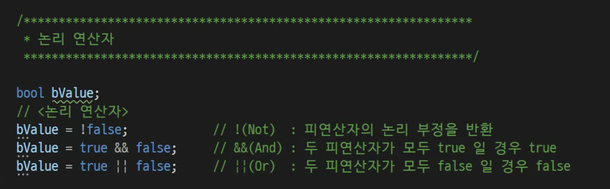

# 4교시 - 2024.03.12
## 조건문
### 주의 사항
- 순서대로 진행하다 보니 값을 역순으로 하면 의도대로 안나올수도있다
- 100 ~ 90: 골드, 89 ~ 80 : 실버, 79 ~ : 브론즈
- 의도한건 골드인데 순서대로 진행하다 보니 브론즈로 나온다 (아래 코드 참조)
```angular2html
int score = 92;
if (score >= 0)
{
    Console.WriteLine("브론즈입니다!");
}
else if (score >= 80)
{
    Console.WriteLine("실버입니다!");
}
else if (score >= 90)
{
    Console.WriteLine("골드입니다!");
}
```
#### if 
- 맞다면 에만 해당
- 조건작업(분기)을 함
- 조건에 따라 실행이 달라지게 할 때 사용하는 문장
- 조건식의 true, false에 따라 실행할 블록을 결정하는 문법

```angular2html
// 실행된다
int hp = 100;
int damage;
string input = Console.ReadLine();
damage = int.Parse(input);

// 비교 연산자
bool alive = hp > damage;
// 100 > 20 : 100이 20보다 크다 : true
// 100 < 20 : 100이 20보다 작다 : false
// 100 >= 100 : 100이 100보다 크거나 같다: true
// 100 > 100 : 100이 100보다 크다 : false // 100 == 100 : 왼쪽이 오른쪽과 똑같으면 : true
// 100 == 101 : 왼쪽이 오른쪽과 다르면 : false
// 100 == 100 : 왼쪽이 오른쪽과 같지않다 : false
// 100 != 101 : 왼쪽이 오른쪽과 같지않다 : true
//
if (alive) // 참일때만 실행
{
Console.WriteLine("살아남았다!");
}
Console.WriteLine("끝!");


int exp = 150;
int level = 1;

if (exp >= 100)
{
// 레벨업
level++;
Console.WriteLine("레벨업!!!!");
exp -= 100;
}
Console.WriteLine("레벨 : {0}", level);
Console.WriteLine("결험치 : {0}", exp);
Console.WriteLine("끝!");
```

#### if else if
- 그 밖에 (그 외)
- 여러가지 조건 줄때 사용
```angular2html
// 컴퓨터 : 가위
Console.WriteLine("가위!! 바위!! 보!!");
string playerChoice = Console.ReadLine();
if (playerChoice == "바위")
{
Console.WriteLine("이겼습니다!");
}
else if (playerChoice == "가위")
{
Console.WriteLine("비겼습니다");
}
else if (playerChoice == "보")
{
Console.WriteLine("젔습니다");
}
```


#### else 
- 모두 안맞을 경우
```angular2html
Console.WriteLine("가위!! 바위!! 보!!");
string playerChoice = Console.ReadLine();
if (playerChoice == "바위")
{
    Console.WriteLine("이겼습니다!");
}
else if (playerChoice == "가위")
{
    Console.WriteLine("비겼습니다");
}
else if (playerChoice == "보")
{
    Console.WriteLine("젔습니다");
}
else
{
    Console.WriteLine("잘 못 입력했습니다.");
}
Console.WriteLine("게임 종료");
```

### 다시보는 TryParse
```angular2html
Console.Write("골드를 입력해주세요 : ");
string input = Console.ReadLine();
int gold;
bool success = int.TryParse(input, out gold); // 성공: true, 실패: false 로 바뀜

if (success)
{
    Console.WriteLine("입력하신 골드 : {0}", gold); // 성공하면 입력한 값을 넣어주고 실패하면 0 
    gold += 10000;
    Console.WriteLine("만원 입금 후 골드 : {0}", gold); // 실패 했을 때 1
}
else
{
    Console.WriteLine("잘못된 값을 입력하셨습니다..."); // 성공하면 입력한 값을 넣어주고 실패하면 0 
}
```

### 연산자와 조건문
- 의사코드
- 단계별로 잘게 쪼개기 위해
- 다한 후 주석 지우면 코드 완성
```angular2html
        const int maxItemCount = 8; // const를 쓴이유는 아이템이 8개를 넘지않는다고 생각해서
        int potionCount = 2;
        // 포션을 먹으면 인벤토리에 추가한다
        // ->
        // 1. 인벤토리가 가득 찼는지 확인해본다.
        if (potionCount >= maxItemCount)
        {
            //  1-1. 꽉 찼으면 안먹는다.
            Console.WriteLine("포션을 먹지 못합니다.");
        } 
          //  1-2. 꽉 차지 않았으면
        
        // 2. 이미 포션이 있는지 확인해 본다
        // 2-1. 이미 포션이 있었으면
        else if (potionCount >= 1)
        {
            //  2-2. 포션갯수를 하나 늘린다
            potionCount++;
            Console.WriteLine("인벤토리에 있는 포션에 갯수를 하나 늘립니다!");
        }  
        // 3. 포션이 없었으면
        else if (potionCount == 0)
        {
            //  3-1. 새로 포션을 얻고
            potionCount = 1;
            //  3-2. 인벤토리에 칸에 표시한다.
            Console.WriteLine("인벤토리에 포션을 새로 추가합니다!");
        }
```

### 논리연산자
 
```angular2html
        // 어몽어스 (마피아)
        // 시민
        // 1. 모든 임무를 완료하기
        // 2. 모든 마피아를 검거하기
        // 둘중 하나라도 만족하면 { "||" : OR }
        //   1        2
        if (true || false)
        {
            Console.WriteLine("승리했습니다.");
        }
        
        // 게임 진행 조건
        // 1. 접속이 되어 있고
        // 2. 레디 상태일 때
        // 모두 만족하면 { "&&" : AND }
        // 하나라도 false있으면 안됨
        //   1        2
        if (true && true)
        {
            Console.WriteLine("게임이 가능합니다!");
        }
        
        // 반전 { "!" : Not }
        // true -> false로
        // false -> true로

```


### switch
- 조건값에 따라 실행할 시작지점을 결정하는 조건문
- if랑 똑같은데 왜 쓰나
- switch가 편한 상황일 때
- 1. 조건문이 필요하지 않은 단일 문자로 비교할시 if처럼 == 같은 비교가 필요없다
- 2. 대문자나 소문자 한영키 등 그런거 눌렀을때 같은 케이스 몰아서 추가하고 break 하면 편하게 인식 가능하고
- 3. 조이패드 추가 할경우에서 switch는 케이스 하나만 추가해주면 되는데 if는 블럭 추가가 필요하다
```angular2html
        // switch 조건문 기본
        int value = 5;
        switch (value)
        {
            case 1:
                Console.WriteLine("1입니다.");
                Console.WriteLine("1111");
                Console.WriteLine("1111111111");
                break;
            case 2:
                Console.WriteLine("2 입니다.");
                break;
            case 3:
                Console.WriteLine("3 입니다.");
                break;
            default:
                Console.WriteLine("어느것도 아닙니다.");
                break;
        }
```

#c#
