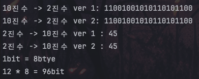
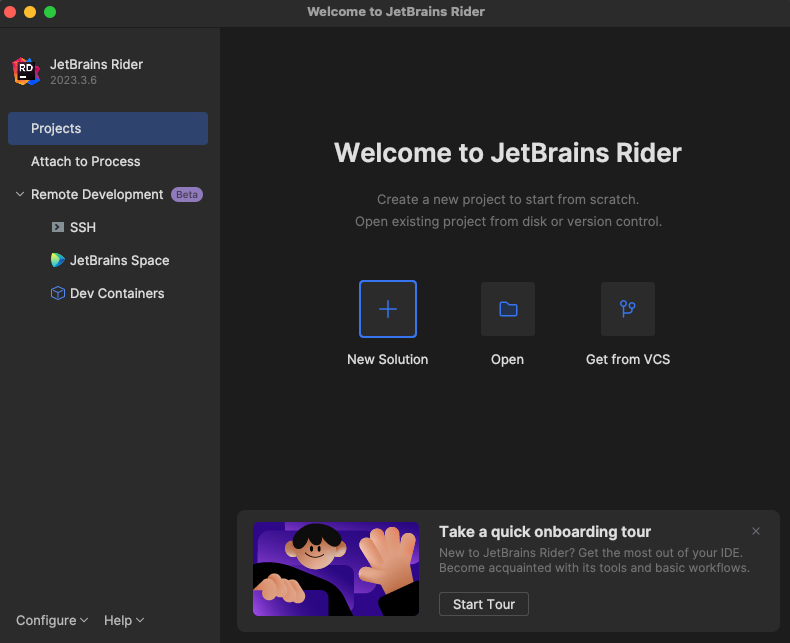

```
    // [ 10진수 -> 2진수 ]
    // 공통
    int commonNumber1 = 824748;
    
    // ver 1
    string binary1 = "";

    while (commonNumber1 > 0)
    {
        // += 를 사용하니 문자열이 뒤집혀서 아래 문법으로 변경했습니다.
        // binary1 += (commonNumber1 % 2);
        binary1 = (commonNumber1 % 2) + binary1;
        commonNumber1 /= 2;
    }
    Console.WriteLine("10진수 -> 2진수 ver 1: " + binary1);
    
    // ver 2
    int commonNumber2 = 824748;
    string binary2 = Convert.ToString(commonNumber2, 2);
    Console.WriteLine("10진수 -> 2진수 ver 2: " + binary2);
    
```
    
```
    // [ 이진수 -> 10진수 ]
    // 공통
    string commonBinary = "101101";
    // ver 1
    int commonBinaryCount = commonBinary.Length - 1; // 0 부터 시작하기 때문에
    int decimalBinary1  = 0;
    while (commonBinaryCount >= 0)
    {
        // binary[count] 아스키 코드 인식해서 계산이 안맞아 다시 0 또는 1로 인식되게 문자형으로 변경
        decimalBinary1 += Convert.ToInt32(commonBinary[commonBinaryCount].ToString())   * (int)(Math.Pow(2, commonBinaryCount));
        // number = binary[count] * Math.Pow(10, count);
        commonBinaryCount--;
    }
    Console.WriteLine("2진수 -> 10진수 ver 1 : " + decimalBinary1);
    
    // ver 2
    int decimalBinary2 = Convert.ToInt32(commonBinary, 2);
    Console.WriteLine("2진수 -> 10진수 ver 2 : " + decimalBinary2);
```
    
```
    // [ bit 계산 ]
    Console.WriteLine("{0}bit = {1}btye", 1, 8);
    Console.WriteLine("{0} * {1} = {2}bit", 12, 8, 12 * 8);
```
- ㄴ 과제 1에 해당하는 파일 입니다.



- ㄴ 코드 결과 값입니다.


- 비주얼 스튜디오 다운 했지만 윈도우만 지원하여 rider로 대체해서 설치했습니다.


- ㄴ rider 메인 화면 입니다.
